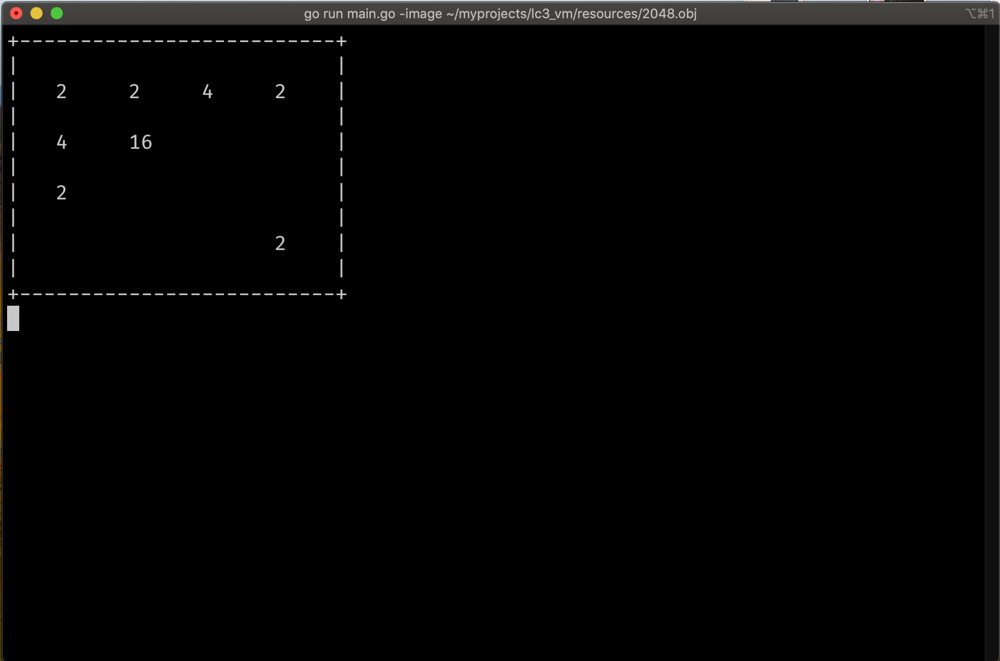
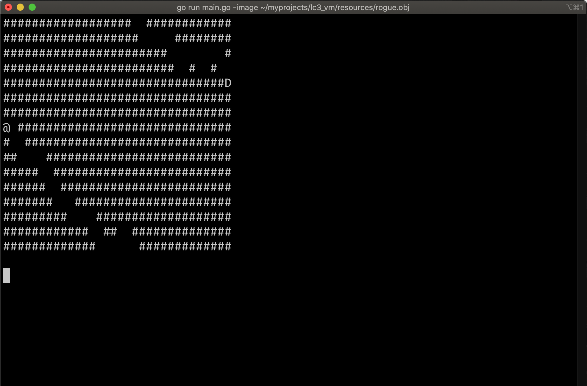

# LC3

LC-3 (Little Computer 3) emulator implemented in Go. 

See more:
- https://en.wikipedia.org/wiki/Little_Computer_3
- https://justinmeiners.github.io/lc3-vm/supplies/lc3-isa.pdf
- https://www.cs.utexas.edu/users/fussell/courses/cs310h/lectures/Lecture_10-310h.pdf

## Examples:

### 2048 Game:

```
lc3 -image ./programs/2048.obj
```

or

```bash
go run main.go -image ./programs/2048.obj
```

Result:



### Rogue game:

```
lc3 -image ./programs/rogue.obj
```

or

```bash
go run main.go -image ./programs/rogue.obj
```

Result:


